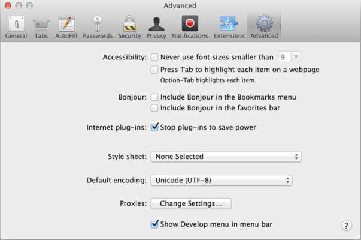

# Consola dezvoltatorului

Codul este înclinat erorilor. Este destul de probabil să comiți erori... Oh, stai, despre ce vorbesc? *Cu siguranță* vei avea erori, cel puțin dacă ești om și nu robot (https://en.wikipedia.org/wiki/Bender_(Futurama)).

Dar în browser, un utilizator nu poate vedea erorile în mod implicit. Așa că, dacă ceva merge prost în script, nu vom putea vedea ce s-a stricat și nu vom putea repara.

Pentru a vedea erorile și a strânge alte informații folositoare despre script-uri, "unelte pentru dezvoltatori" (developer tools) au devenit încorporate în browsere.

Cel mai adesea dezvoltatorii sunt înclinați înspre Chrome sau Firefox pentru dezvoltare, deoarece aceste browsere au cele mai bune developer tools. Alte browsere oferă de asemenea developer tools, uneori cu trăsături speciale, dar de obicei încearcă să prindă din urmă pe cele din Chrome sau Firefox. Așa că majoritatea majoritatea oamenilor au un browser "favorit" și folosesc altul dacă apare o problemă specifică browser-ului.

Developer tools sunt puternice; există multe caracteristici. Pentru a începe, vom învăța cum să le deschidem, să ne uităm la erori și să rulăm comenzi JavaScript.

## Google Chrome

Deschide pagina [bug.html](bug.html).

Există o eroare în aceasta. Este ascunsă de ochii unui vizitator obișnuit, așa că să deschidem developer tools pentru a o vedea.

Apasă `tasta:F12` sau, daca ești pe un Mac, `tastele:Cmd+Opt+J`.

Uneltele pentru dezvoltatori se vor deschide în Console (consolă) în mod implicit.

Arată ceva în genul acesta:

Aspectul exact al uneltelor depinde de versiunea ta de Chrome. Se schimbă din timp în timă dar ar trebui să fie similar.

- Aici putem vedea mesajul eroare de culoare roșie. În acest caz, script-ul conține o comandă străină,"lalala".
- Pe dreapta, este un link clickable către sursa `bug.html:12` cu numărul liniei pe care a apărut eroarea.

Sub mesajul de eroare, există un simbol albastru, `>`. Marchează o "linie de comandă" unde putem tasta comenzi JavaScript. Apasă `tasta:Enter` pentru a le rula (`tastele:Shift+Enter` pentru a insera comenzi multi-linie).

Acum putem vedea erori, iar asta e suficient pentru început. Vom reveni la uneltele pentru dezvoltatori mai târziu și vom acoperi debugging-ul mai în detaliu în capitolul <info:debugging-chrome>.

## Firefox, Edge, și altele

Majoritatea celorlalte browsere folosesc `tasta:F12` pentru a deschide uneltele pentru dezvoltatori.

Aspectul și senzația lor este chiar similară. Odată ce știi cum să folosești una dintre aceste unelte (poți începe cu Chrome), vei putea să treci la altele cu ușurință.

## Safari

Safari (browser Mac, nu este suportat de Windows/Linux) este ceva mai special în acest caz. Trebuie să activăm "Meniul de dezvoltare" (Develop menu) mai întâi.

Deschide Preferințe (Preferences) și mergi la panoul "Avansat" (Advanced). La capăt exista un checkbox:

Acum `tasta:Cmd+Opt+C` poate comuta consola. De asemenea, observă că noul item de sus denumit "Develop" a apărut. Acesta conține multe comenzi și opțiuni.

## Rezumat

- Uneltele pentru dezvoltatori ne permit să vedem erorile, să rulăm comenzi. să examinăm variabile și multe altele.
- Ele pot fi deschise cu `tasta:F12` pentru majoritatea browserelor sub Windows. Chrome pentru Mac are `tastele:Cmd+Opt+J`, Safari: `tastele:Cmd+Opt+C` (trebuie să le activezi mai întâi).

Acum avem mediul pregătit. În următoarele secțiuni vom trece la JavaScript.